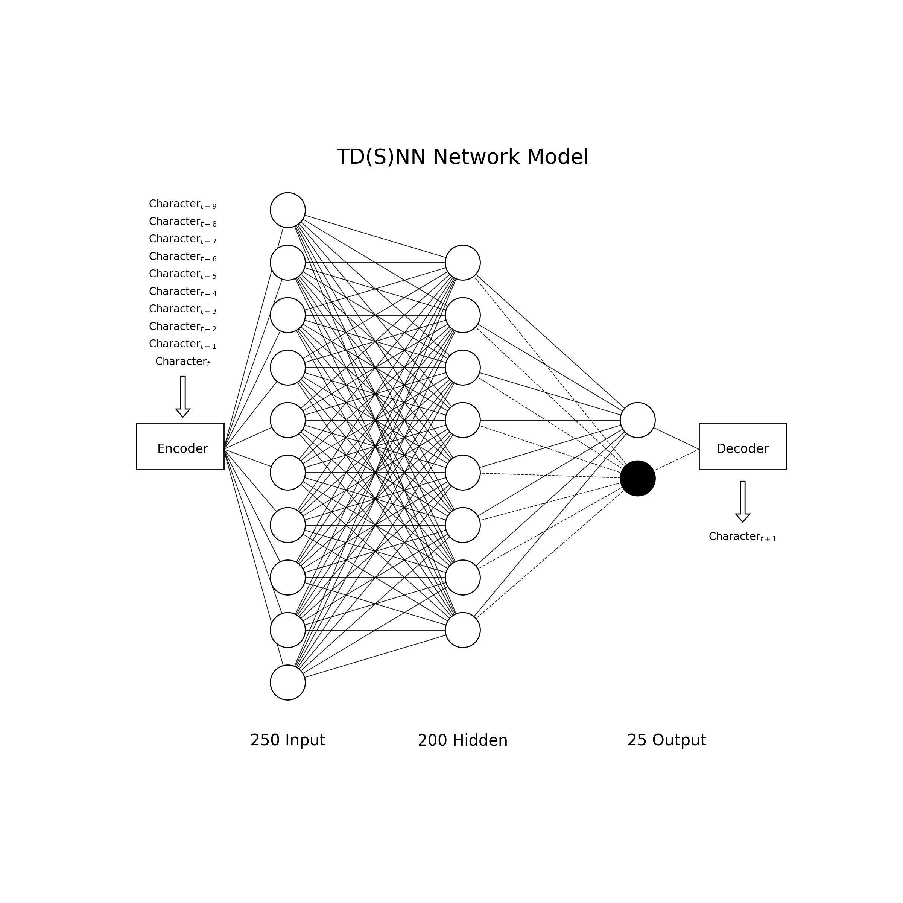
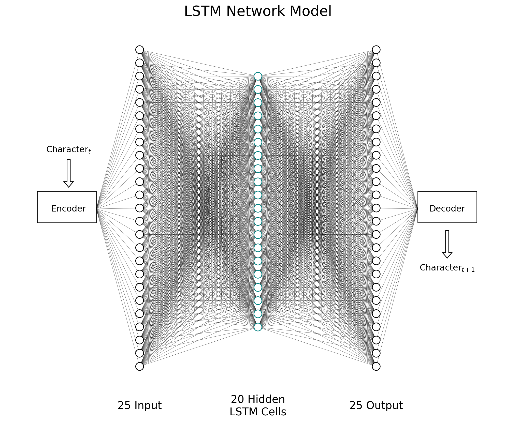
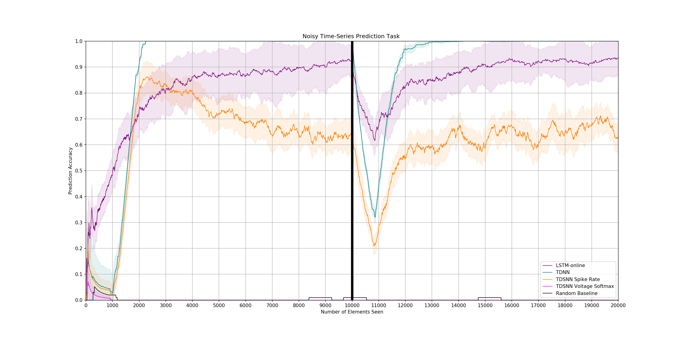

# sequence-learning
Adapted from *Continuous Online Sequence Learning with an Unsupervised Neural Network Model*.

## Time delay neural network (TDNN)

## Long short-term memory (LSTM)

## Hierarchical Temporal Memory(HTM)

## Results

