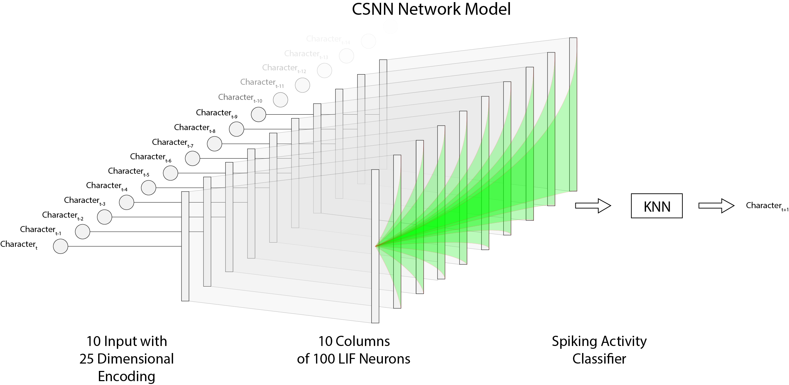
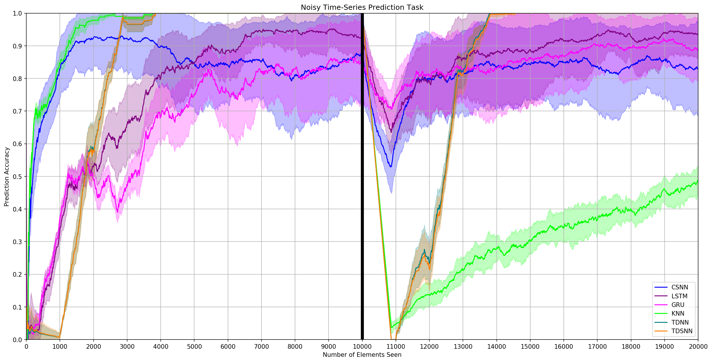
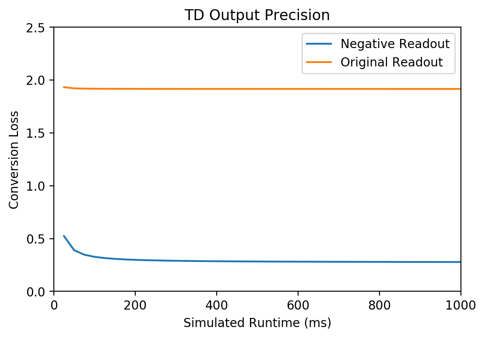

# sequence-learning

## Time delay neural network (TDNN)

## Long short-term memory (LSTM)

## Columnar Spiking Neural Network (CSNN)

## Results

### Artifical Dataset Prediction Task

### TDNN to TDSNN Conversion Loss

## References